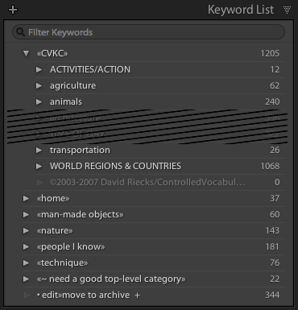
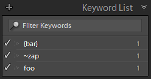
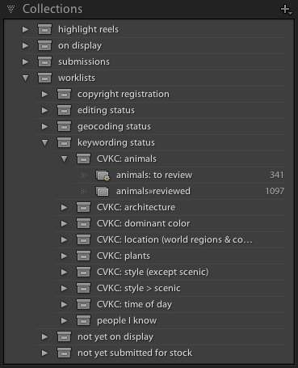
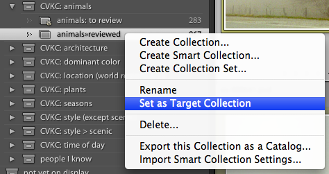
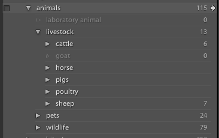

+++
title = "Lightroom Technique: Staying Organized with Controlled Vocabulary"
date = 2009-02-04T23:41:14-08:00

[extra]
cover = "es-1288-067"
first_published_on = "ericscouten.com"
+++

Do too many keywords in your Lightroom catalog have you spinning round and round?

<!-- more -->

{{ es_image(id="es-1288-067" title="Spin Me Around" caption="Keukenhof Gardens, Lisse, The Netherlands, 2008" inventory=false) }}

Here are a couple of simple tricks I use to keep me organized with over 10,000 keywords in my catalog.

## Organize Your Keywords with Category Headers

I’m a big fan of David Rieck’s [Controlled Vocabulary Keyword Catalog](http://www.controlledvocabulary.com/products/lightroom.html). It’s a well-organized and (for me, at least) comprehensive keyword set. I believe my keywording is much richer for using the CVKC. But … it can also be intimidating. 11,000 keywords? How do you manage all that?

In designing the way I use keywords in my catalog, I was looking for answers to a few questions:

* I have my keywords organized hierarchically (not just the ones I get from CVKC; there are others of my own). If I add a new keyword, how will I remember to make sure it has a home in the hierarchy?
* How can I keep the CVKC keywords separate from other keywords I’ve derived on my own (like members of my family)?

The solution, for me, was to place all of my keywords under top-level **category headers,** as shown here:

The important things about these category headers are:

* The names make them gravitate to the top or bottom of the keyword list. If I add a new keyword via the Keywording panel and forget to find a home for it in the hierarchy, that keyword will stand out.
* These keywords are for organizing only, so I’ve asked Lightroom not to export them. (Right/control-click on the keyword, choose Edit Keyword Tag, turn off “Include on Export.”)

There’s nothing special about the «» characters, except that they cause the keyword to sink to the bottom of the list on Mac. They’re used as quotation marks in some European languages. As an English speaker, I’m unlikely to use them otherwise, so they stand out for me. You could just as easily use \_, $, regular old angle brackets <>. What symbol you use doesn’t really matter, so long as it's the first letter in the keyword name.

**Mac users:** If you want to be cool like me 😉 and use the «» characters, type Option-backslash («) and Option-Shift-backslash (»). There’s no real reason to use the trailing », except that I think the names look funny without them.

**Windows users:** It looks like Windows wants to sort all special characters to the top of the list. (Why?) I've tried several but haven’t found one that sinks to the bottom. If you find one, please speak up in the comments. I’d probably just use an underscore \_ in front of the category header keyword names. It’s easy to type and floats to the top.

**Update (20 February 2009):** It was suggested in the comments that braces, tilde, or vertical bars would sort to the bottom. Unfortunately, they don’t. Here’s a screen shot of the Keyword List panel from Windows with those characters in place. Note that vertical bars are not allowed in keyword names.

Also, notice that I’ve indented the entire CVKC under another top-level category header (“«CVKC»” at the top of the list). David has recently posted a version of the CVKC that is similarly indented on the [CVKC downloads](http://www.controlledvocabulary.com/download.html) page. (Paid subscription required — look for the version labeled SubLevel under Lightroom.) His top-level category is CVKC instead of «CVKC». Again, what name you use isn’t important, so long as it fits with the other top-level keyword names you use.

I have similar category headers for other major sections of my keywording. Some of these («man-made objects» and «nature») are left over from how I keyworded prior to using CVKC (I just haven’t migrated those keywords yet!) and some (like «home» and «people I know») just don’t have a natural home in the CVKC. The details of what’s inside those hierarchies isn’t important; just that they’re distinct from CVKC and form a natural organization of their own.

_What if you've already been using the “classic” CVKC and you want to adopt this approach?_ My suggestion would be to manually create the «CVKC» heading and then drag each of the parent keywords underneath it, one by one. There aren’t that many of them, and there isn’t (unfortunately) a better solution that I know about.

## Use Worklists to Remember What Keywording You’ve Done

I’ve found that if I simply look at one of my photos and try to enumerate all of the keywords that might fit, I’ll almost certainly miss many relevant keywords that are already in the CVKC. So rather than try that approach, I divide and conquer in fairly thin horizontal slices of the keyword collection. For instance:

What’s in these collections? The short version is:

* Identify one of the major headings in the CVKC that you care about (i.e. “animals,” “architecture,” “dominant color,” etc.).
* Create a collection which contains all of the photos you’ve reviewed for that section of the CVKC. (For example, “animals»reviewed”.)
* Create a smart collection which shows you all of the photos that are not in the reviewed collection.

For a more in-depth discussion of this worklist technique, see my article from last August on [using smart collections to create worklists](/articles/lr-technique-smart-collections-and-worklists/).

Once you’ve done this basic set-up work, you can start to work through your list of photos to keyword. Here’s how I do it:

**1. Right-click on the “reviewed” collection and choose Set as Target Collection.**

You should see a + sign appear next to the collection name.

**2. Click on the “to review” smart collection.**

**3. Open the Keyword List panel to the corresponding section.** Close everything else on the right side of the screen.

I find that I can often fit most of the keywords under a top-level section onto one screen, which makes the following steps much faster.

**4. Start keywording!**

I usually just work through the photos in the order that they appear, but you can go through them in whatever order makes sense.

I intentionally focus _only_ on the keywords under a particular section (in this case, “animals”), intentionally neglecting the rest of the keyword panel.

Once I’ve identified all of the animals in the photo, I hit the **B** key. That assigns the photo to the Target collection. Remember: Back at Step 1, we said that was the “reviewed” collection. As soon as you do that, the photo drops out of the “to review” smart collection and the next one appears.

I also hit the **B** key if I have a photo with no animals. That just means I’ve looked at the photo and confirmed that there are no animals.

If you have long sequences of similar subject matter, you can also go into Grid view in the Library module. Select as many photos as you can that share the same keywords. Mark those keywords and hit B. The whole batch of photos will disappear and you can move to the next individual photo or group of photos.

## Conclusion

I hope this keywording approach is useful to you. I find that I’m able to manage the complexity of lots of keywords fairly well with the category headers, and that the divide-and-conquer approach lets me maintain my concentration on keywording much longer than if I tried to scroll through the list of keywords for every individual photo.
