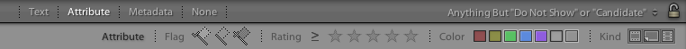

+++
title = "Lightroom Technique: How I Organize My Catalog and Why"
date = 2012-03-05T22:07:28-08:00

[extra]
# cover = "es-1288-067"
first_published_on = "ericscouten.com"
+++

In this article, I describe some of my latest thinking on Lightroom organization. As with past versions of this article _(which are no longer published)_, I share my current practices here not because I want to preach that this is the One True Way to Organize Your Photos, but to provide a starting point for you in setting up your own Lightroom workflow. If this fits as a whole, great! If not, pick and choose what works for you and adapt the rest to meet your needs.

<!-- more -->

**2023 Update:** What I wrote here a decade ago (!) remains largely true in my workflow today. I continue to use what is now called Lightroom Classic as it offers more flexibility and organizational power than the cloud version of Lightroom.

I’m writing this just as [Lightroom 4](https://www.adobe.com/products/photoshop-lightroom.html) has been announced (congrats to my friends and former teammates!), but I’ve been using this technique for a while with Lightroom 3 and everything I write here should apply equally well to either version.

## Overview: What Goes Where and When

I’m back to One Big Catalog, but it retains some of the key elements that I described in the 2009 article. Here’s a snapshot of my current Lightroom folders panel:

So what’s in these folders?

* **Edit Queue:** These are the photos that are in flux and likely to change frequently in the near future. ~~The folks at Dropbox may hate me for saying this because it consumes a lot of upload bandwidth, but this folder actually lives on Dropbox so that I can count on these files being backed up regardless of whether I’m at home or away.~~ **2023 Update: I no longer use Dropbox, but this same purpose is accomplished by using iCloud Drive.**
  * **Edit Stage 1 - Basic Metadata:** This is where photos first get imported. They’re organized by date. The date folders are generated by Lightroom from the capture date. I keep photos here until I’ve attached basic metadata to them (who’s in the photo, where was it taken, etc.).
  * **Edit Stage 2 - Triage:** Once I’ve completed the basic metadata, I move photos here while I decide how or if I’ll process them further. The subfolders here are manually assigned. If I’m traveling, the folder will be named for the start date of the trip and its location (i.e. “2007-11-26+ New Zealand + Fiji”). If not, I’ll generally name it for a year and the major theme (i.e. “2012 Family”). I initially experimented with having more edit stages (and more may make sense for you, depending on your workflow habits), but these two stages seem to make sense for me.
* **Display:** These are the (non-family) photos that I have decided to share in public. They get moved here when I’ve decided on a final rendering of the photo. The subfolders are the same names that you saw in Edit Stage 2 - Triage above. There’s a little bit more depth than that and I’ll explain that a bit later.
* **Display (Family and Friends):** Same as Display, but for the personal photos.
* **Not for Display:** These are the photos that didn’t make the cut for either of the Display folders. You could think of this as an external drive that I typically leave at home.
* **Other:** Photos that I want to keep for handy reference, but that aren’t really “display” photos in the typical sense (for instance, historical family photos).
* ~~**All Raw:** This was left over from the 2009 system.~~ **2023 Update: No longer present.**

In my 2009 article, I listed some complaints with my previous system. Let’s circle back to those complaints and see how I’ve answered them in this new system:

* **I wanted to have my best photography with me in a way that I could get to easily.** The new Display folder is small enough that it fits easily on my laptop hard drive. (It _does_ help that I’m now using a laptop with a 500GB drive instead of the <200GB drive I had in 2009. 😀 It also helps that I’m still editing very, very conservatively and showing maybe 1% of what I shoot.)
* **I wanted to avoid showing my less-than-best photography.** Again, the new Display folder serves as an automatic filter for the work I’ve chosen to spend the most time on.
* **I was spending too much time placing photos in folders based on location.** I’m no longer segregating photos by _each location_ on a trip as I was in 2008, but rather placing all photos from a trip together in one big folder. This has proven much more manageable for me over time.

## Getting Started: Importing Photos

As I mentioned before, photos initially land in the Edit Stage 1 folder. Here’s how the import dialog looks when I use it:

Let’s walk through the dialog and we’ll see why I choose each setting:

* **Import Method** _(not shown  in this screen shot)_: I usually, but not always, [copy as DNG](https://helpx.adobe.com/photoshop/digital-negative.html) immediately upon import. I prefer DNGs over RAW files because the metadata cannot be separated from the image data. (In other words, I don’t like the requirement that raw files have a separate XMP “sidecar” file sitting next to them.) If I don’t do this conversion immediately, it’s because I’m in a hurry at that time. I always convert to DNG at some point in the workflow; the only question is when do I take the time hit.
* **Initial Previews:** Depending on how much time I have at the moment, I switch between Minimal and 1:1.
* **File Renaming:** My file naming template is a fairly simple one: my initials, an import sequence number, and an image sequence number. This numbering sequence flows back to my film days (when it was roll# and frame#) and helps me ensure that the number never changes. If I were starting fresh, I might use something date-based, but this works well for me.

* **Apply During Import:**
  * **Develop Settings:** I apply a [template](PV%2B2012%2B%2B%2BAuto%2BTone%2B%2B%2BAuto%2BLens%2BProfile.lrtemplate.zip) that sets Process Version 2012, auto tone, and auto lens profile.
  * **Metadata:** I apply my copyright information right off the bat using a template that contains my copyright and contact information.
  * **Keywords:** I never apply keywords in the import dialog because there are almost always multiple subjects in my photos.
  * **Destination:** This is the Edit Stage 1 folder inside my Dropbox folder as described above. I have Lightroom organize into folders by date as a starting point for organization.

## Edit Stage 1: Basic Metadata

Typically photos live in this stage fairly briefly until I can add some very basic metadata to them. I don’t always perform these steps in the same order, but I always do each step for every photo:

* **Throw out the obvious crap.** If a photo is badly technically flawed (seriously out of focus, badly exposed, etc.), I throw it out (i.e. delete it) as soon as possible. If it’s blurry today, it’s going to be blurry tomorrow and will still be blurry ten years from now. Don’t waste your time or storage on it.
* **Add location metadata.** While I can still remember where it is, I mark every photo for location using the Location tagset in the Metadata panel. I fill in Location (if applicable), City, State, and Country. (Change from 2009: I no longer populate the country code as I find that some photo sites — notably Flickr — pick up the country code and make an unwanted keyword out of it.)
* **Geocode.** As much as possible, I add GPS track log data to each photo.
* **Convert to DNG** (if not done at import time).
* **Clear the card or phone, but not until I have a confirmed backup.** Since I place my Edit Queue on Dropbox, the back up happens automatically whenever I’m online. I wait until I see that iCloud is fully up to date before clearing photos off of the original source. Whether you use iCloud or Dropbox or something else, **I can’t stress the importance of backups enough:** Bad Things happen to computer hard drives (theft, media failure, etc.) and they invariably happen at Very Inconvenient Times. Though painful and maybe costly, you can always replace a lost, damaged, or failed computer or camera. The odds that you can recapture what you’ve photographed are a lot smaller.

At this stage, I’m not making much of an artistic judgement about the photos, I’m just trying to get some of the raw mechanics out of the way.

## Moving to Edit Stage 2

When I have a bit more time (sometimes the same day, sometimes many days later), I’ll organize them into folders that help me find them later. Since a lot of my photography happens when I travel, I often use the trip as an organizing metaphor. For those that are taken around home, I organize a bit more by subject. I encourage you to think about how and when you shoot; there may be be more important dividing lines for you than the ones I’m citing. Whatever the dividing line, I think it helps if it satisfies the following criteria:

{{ es_cdn_image(id = "es-0964-038n", cdn_version = "v1", cdn_key = "img/v1/2005/09/es-0964-038n" title = "Friendly Pelican?" caption = "Mykonos, Greece, 2005") }}

* **It isn’t likely to change over time.** This is why I avoid sorting by keywords. A photo might fit into several categories. Consider the photo above: Would you put it in a birds folder, a street scenes folder, a people folder, a Greece folder, a Mykonos folder, or … ? You get the point. There are many concepts being shown in the photo and they are at odds with each other. Where folders are concerned, you have to make a single choice.
* **You shouldn’t have to make a photo-by-photo decision.** That’s too time-consuming. If I’m traveling, I can often select all photos from a single date folder and say these are all in the \_\_\_ trip. Taking the same photo again, I might decide to place it in a birds folder, but then the next photo could be about something completely different.

My naming criteria at this point is:

* If I’m traveling, I name the folder for the first day of the trip followed by the major destination(s) on the trip. I use year-month-day formatting so the trips sort sequentially. If the trip spans multiple days, I’ll use a + sign after the date to remind me of that, as in “2008-04-12+ Holland” in this screen shot.
* If I’m shooting a special subject locally, I’ll mark it year-month-date name of subject. In this screen shot, you can see “2012-02-02 Ferry Sunrise.”
* If it’s a recurring theme (i.e. photos of my family), I’ll mark it for the year and the subject, but will avoid getting more detailed than that. For example, “2012 Family.” If there‘s no theme that makes sense, I'll just call it “Random” as in “2012 Random.”

I also fill in the IPTC job field at this same time with the same name I’ve given the folder. You’ll see why a bit later.

The end result of this process is the photos end up roughly sorted by major subject area and ready for me to think through them more carefully when I have time.

## Edit Stage 2 – Triage

What _does_ require careful thought is deciding what photos make it out into the public eye. I shoot a lot of duplicates and a lot of variations on a theme until I get to something that makes me happy. Typically I share 1-2% of what I shoot; as you can imagine, it takes some effort to make those cuts.

I use color labels to indicate a final decision about each photo’s fate. Once a photo has a color label, I’m stating that I’m done with the editing process for that photo and it’s ready to leave the edit queue. The color labels I use are as follows:

I start by looking for quick and obvious outtakes. These are the photos that passed the “obvious crap” filter from stage 1, but just don’t have the oomph to be something I’d like to share with the world. I use a filter called “Anything But ‘Do Not Show’ or ‘Candidate’.” (Download my [filter presets here](filter-presets.zip).)

The nice thing about this is that I can quickly zip through photos, culling them by pressing **6** (crap, but I don’t want to delete it) or **7** (meh). The moment I press a key, the photo disappears from the grid or loupe view and I'm on to the next one. There are many variations on this approach (many use pick flags or star ratings). I happen to like this approach, but the others are perfectly valid.

Eventually I’ll whittle the initial set of photos down to one or a handful of photos that I think have some potential. On those photos, then I’ll spend the time in the Develop module to polish them as I see fit, and then I’ll assign the green or blue label (“Display …”) to those photos.

## Clearing Out the Edit Queue

The goal of the edit queue folder is to be a temporary working space until I’ve done my editing and developing work on my photographs. Once I’ve completed that work for a reasonably large batch of photos, it’s time to kick them out of the nest. Usually I do this for several days’ worth of photos at once, so I don’t have to spend as much time on it. I usually do this when I’m at home when my backup drive is readily available. If I’m away from home, I’ll let the photos live in the edit queue until I’m back home.

Here again, I use library filters (again, download my [filter presets here](filter-presets.zip)) to make this job easier. This time, I’m looking for those photos that _do_ have specific labels. So, to move the good photos into the Display folder, I’ll look for those with the green label and move those into corresponding folders in the Display tree. I add a small bit of extra hierarchy here just to keep it from getting too big, like this:

The details aren’t important — and, of course, will depend on what you shoot — but the important thing is to keep a reasonable number of folders at each level. And, of course, I repeat the same thing for the “Not for Display” photos.

This looks a lot like the Incubator to Selects step from my 2009 workflow, except that I’m no longer doing the import and export catalog work. It winds up giving me nearly the same effect with a lot less work, and it works well if I decide to re-process a photo (which I’ve been doing a lot of lately).

## Smart Collections

For the most part, I’m able to find the photos I want just by browsing the Display or Edit Queue folder trees or by using other filters in the metadata browser. Occasionally, however, I do want a roll-up of photos that are located in different places. In those cases, I use a smart collection like this:

This smart collection shows me all of the photos from my recent trip to Nevada and Utah (this is why I populate the IPTC job field) that are either marked for display or not yet marked at all (i.e. still in edit queue).

## Closing Thoughts

I hope this article was helpful to you. I know the comments in previous versions of the article were helpful and thought-provoking for me.

Thank you for reading!
