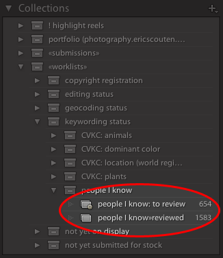
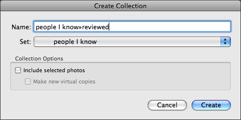
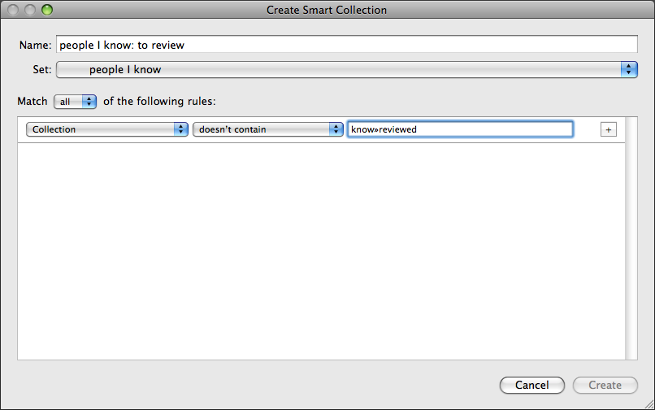

+++
title = "Lightroom Technique: Smart Collections and Worklists"
date = 2008-08-04

[extra]
first_published_on = "ericscouten.com"
+++

Last year, on the Lightroom Journal, I wrote about using worklist keywords (**2022 Update**: This article is no longer available) to keep track of your keywording efforts. In this article, I look at some new and improved ways to accomplish the same thing with Lightroom 2.0.

<!-- more -->

I use **worklists** to keep track of work I want to do on my photography collection. It's well suited for tasks that I do incrementally — a bit at a time, rather than all at once. Examples include:

* keywording,
* editing _(by this I mean deciding which photos remain in the collection and which get deleted or archived out),_
* publishing,
* geocoding, and
* registering copyright.

In last year's article, I described how to do this by using specially-named keywords and some tricks in the Find panel. With Lightroom 2.0, **smart collections** make this process easier and more logical.

## Creating the Worklist

I'll use the same example I used before: I want to keep track of keywording status for a certain subset of my keywording tree: the people I know. In other words, I want to be able to ask these questions and get accurate answers:

* **Which photos have I already keyworded for people I know?** (even just to note that there's nobody I know in the photo)
* And the inverse of that: **Which photos have I _not_ yet keyworded for people I know?** (i.e. my to-do list)

I used to use keywords for this because they were easier to assign than collections, but with Lightroom 2, it makes more sense (to me, anyway) to use collections. Here's why:

* Collections appear in the left panel track and keywords are now in the right panel track, meaning that in this workflow, you don't have to scroll to use both.
* Collection membership doesn't appear in exported metadata for your photos, but keywords do by default. Typically you wouldn't want to share your worklist status with the general public.
* You can make any collection act as the quick collection, meaning that the **B** key becomes a quick assign/unassign shortcut.

The screen shot above shows the Collections panel with my worklist keywords highlighted.

There's a collection here that matches each of the questions I asked earlier:

The collection titled **"people I know»reviewed"** answers the question: "Which photos have I already keyworded." I add each photo to this collection as I do the work of keywording for people I know. When I achieve my goal of having reviewed every photo in my library for people I know, every photo in my catalog will be a member of this collection.

The smart collection above it, titled **"people I know: to review,"** answers the inverse question: "Which photos have I not yet keyworded." We'll get to how it's built in a moment, but it's basically constructed as the inverse of the first collection. When I achieve my goal of having reviewed every photo in my library for people I know, this collection will be empty.

Now that I've explained what I'm trying to accomplish, here's how I do it:

**Step 1: Create the collection set that will contain this worklist.** Click on the plus-arrow at the top-right of the Collections panel and choose **Create Collection Set…**. Give the set a descriptive name. If you want to place this set inside another set (as I've done, placing it inside my "keywording status" collection set), you can do this here.

**Step 2: Create the collection that will represent your completed work.** First, click on the collection set to make sure that it's highlighted. Then click on the plus-arrow and choose **Create Collection…**. Choose a name for this collection. Make sure the Set popup still points to the desired collection set, and make sure the "Include selected photos" checkbox is turned off.

**Important:** The name of this collection must include a single word that does not appear in the name of any other collection you have. I recommend including some special character or symbol that's not otherwise likely to appear instead of a space. You'll see why in a moment when we build the smart collection. This is why my collection has the slightly unusual name "people I know»reviewed." The word "**know»reviewed**" is what I'll be searching for. (Mac users: You can type the » character — on an English keyboard at least — by typing Option-Shift-backslash. Windows users: I recommend using something simpler like ~.)

**Step 3: Create the smart collection that will represent your to-do list.** Make sure the collection set is still highlighted. Then click the plus-arrow and choose **Create Smart Collection…**. Again, make sure the Set popup points to the desired parent collection set. Then configure the collection as shown below:

Hrm. That screenshot is a little scrunched. The popups read, in order: "Collection" "doesn't contain" "know»reviewed". The important part is that the text field contains the same _single word_ you chose above in step 2 — and nothing more. If you enter multiple words separated by spaces, it will look for _all_ of those words _separately,_ which is not what you want.

That's it! You should now have the same arrangement in your Collections panel that I highlighted in the first screen shot above. Your "reviewed" collection should have zero photos in it, and your "to review" smart collection should have the same number of photos as the "All Photographs" entry in the Catalog panel.

So ... we've got keywording to do! Let's get to it!

## Doing the Work and Keeping Track

When I'm ready to do some keywording, I lay just a little bit of groundwork first:

**Step 1: Right-click on the "reviewed" collection and choose Set as Target Collection.** You should see a + appear after the collection's name. This means that the **B** key will add or remove a photo from this collection.

**Step 2: Click on the "to review" smart collection.**

Simple, eh? The photos in your library grid are the photos that you haven't reviewed yet.

You select individual photos or groups of related photos. Assign the relevant keywords to them. _(Notice that the photos remain in view at this point. This is a good thing — you might have to assign several keywords. You wouldn't want the photo to disappear after the first keyword, right?)_ When you're sure you have the right keywords assigned to the selected photo(s), press the **B** key.

The selected photos disappear immediately from view. Handy, huh?

Even if no keyword in this list applies (i.e. there's nobody you know in a particular photo), press the **B** key anyway. This just means that you've reviewed the photo and you're sure that it's correctly keyworded for people you know.

Turns out you can whittle through a worklist pretty quickly this way. The things I really like about this technique are:

* It doesn't matter in what order you work through the photos. If you don't feel like keywording a particular group of photos, no problem. Skip around them and catch 'em next time.
* It doesn't matter how many of the photos you sort through at any one time. If you don't do any keywording for six months, the "reviewed" keyword will still keep track of the work you've already done. Your to-do list will remain exactly the same, except for any new photos you may have imported since then.

## Variation: Sorting Photos Into Two Bins

I use a variation on this technique to sort photos into two distinct bins for my editing decision workflow.

Background: I don't particularly care to sort through the dozens or even hundreds of variations on a particular theme that I might shoot on a particularly trigger-happy day. But I also don't want to permanently delete them. So instead I create "archive" catalogs where I park the second-tier photos in case I need them someday. (In practice, that means I never really look at them again, but that's another story…)

So every one of the photos in my main catalog is sorted into two bins, plus a "not yet decided" pile:

* **keep:** I've decided this is worth keeping in the main catalog. It's the best rendition I have of a particular subject (or at least, it's one of a small number of best shots).
* **archive:** Worth saving "just in case," but doesn't rise to the very top of the pile.

The "keep" pile is a standard collection, just like I described earlier.

The "archive" pile is a keyword with a special name. I decided to use keywords here for a couple of reasons:

* These photos are not likely to be exported, so I don't care as much about stray metadata.
* The **B** key is already used for the "keep" pile (target collection). But the **Shift-K** shortcut (right-click on a keyword and select "Use This as Keyword Shortcut") is still available.

The "to do" list is only slightly more complicated than in the first case I described earlier. I create two conditions. (Click on the + to the right of the first condition to add another row.) They are:

* Collection / doesn't contain / edit»keep _(change this to suit your "keep" collection's name)_
* Keyword / doesn't contain / edit»move _(again, change to match your keyword's name)_

Then I just move through the to-do list, typing **B** for those photos I want to keep and **Shift-K** for those I want to archive out.

When I'm done with my edits, I select all the photos with the "edit»move to archive" keyword, export them as an independent catalog (File > Export as Catalog…), and delete them from the main catalog.

Thank you for reading. I hope you've enjoyed this article and that it helps you be more efficient and productive in Lightroom.
